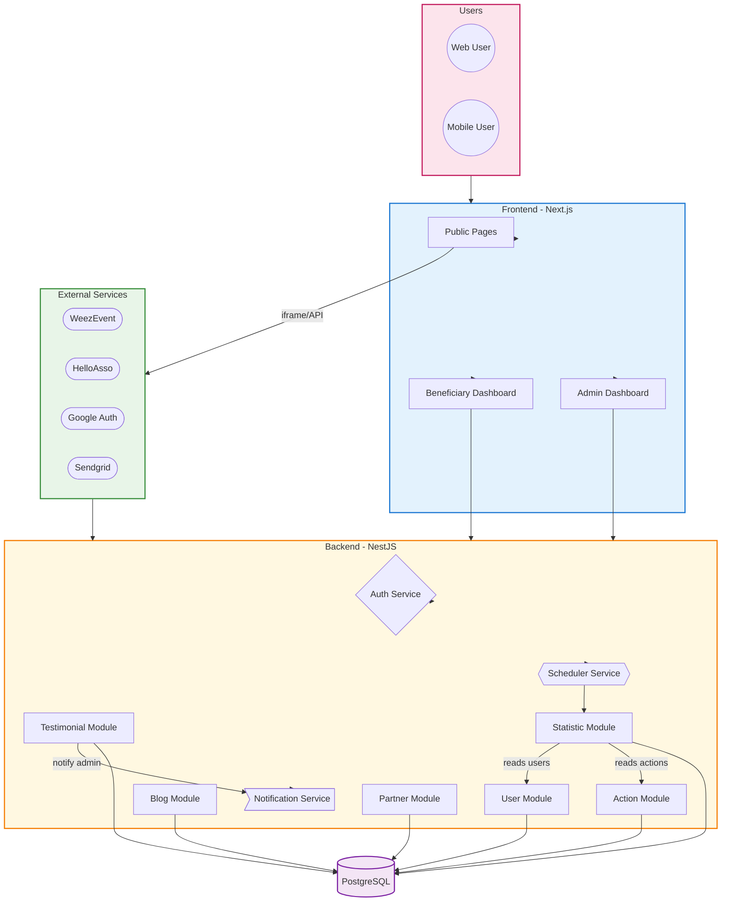
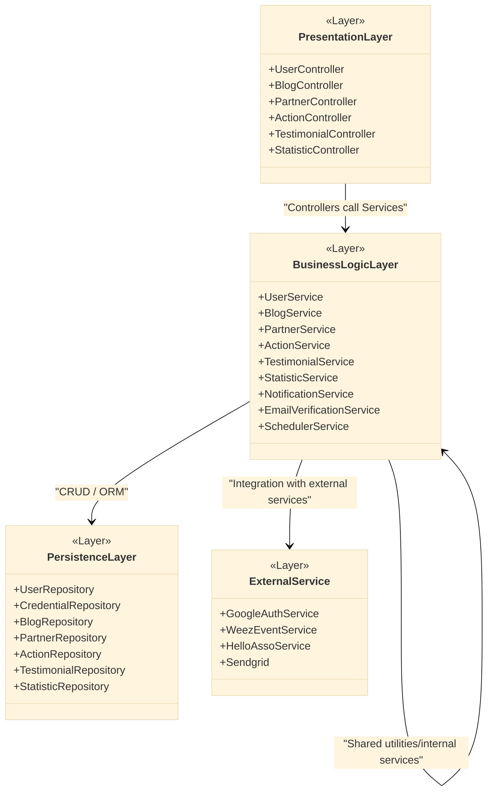
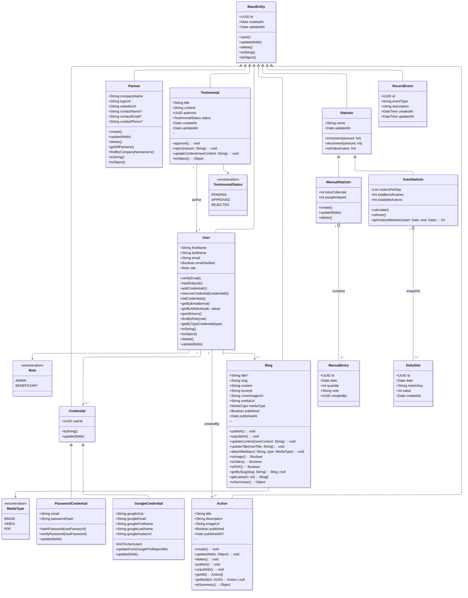
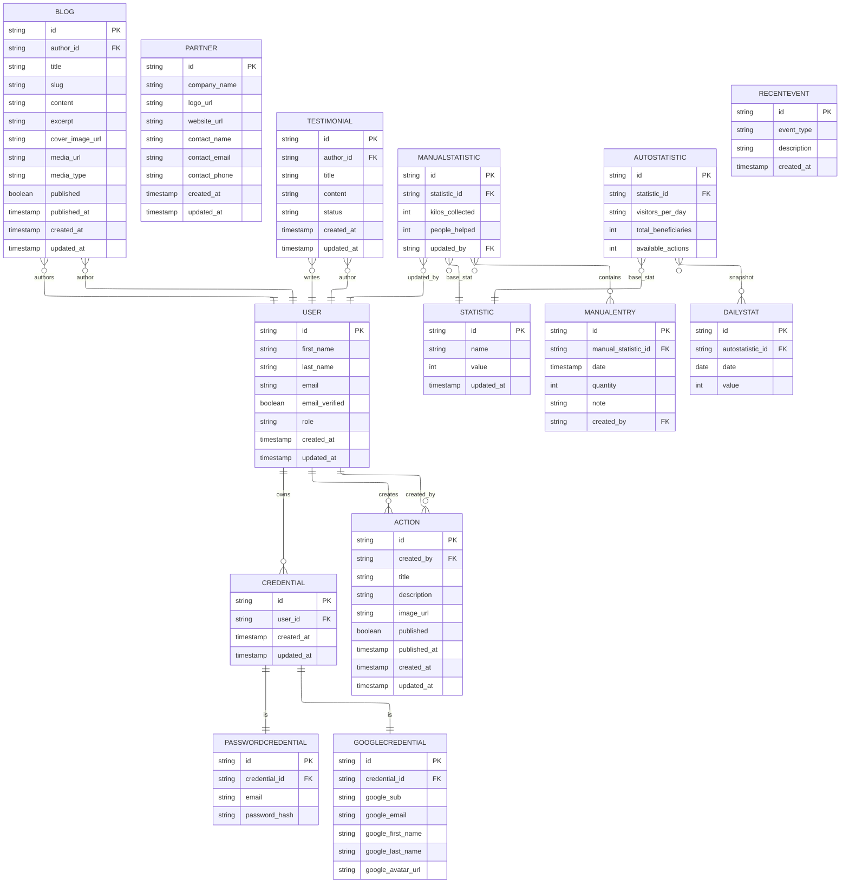
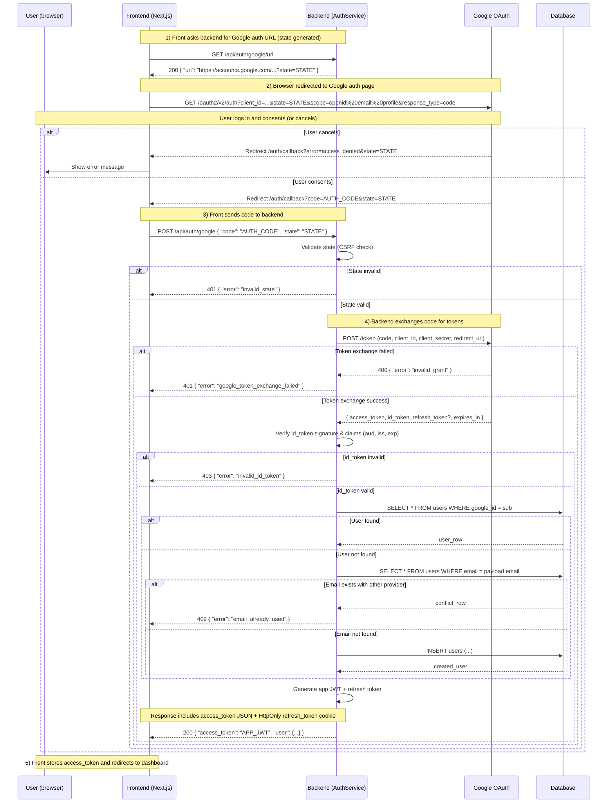
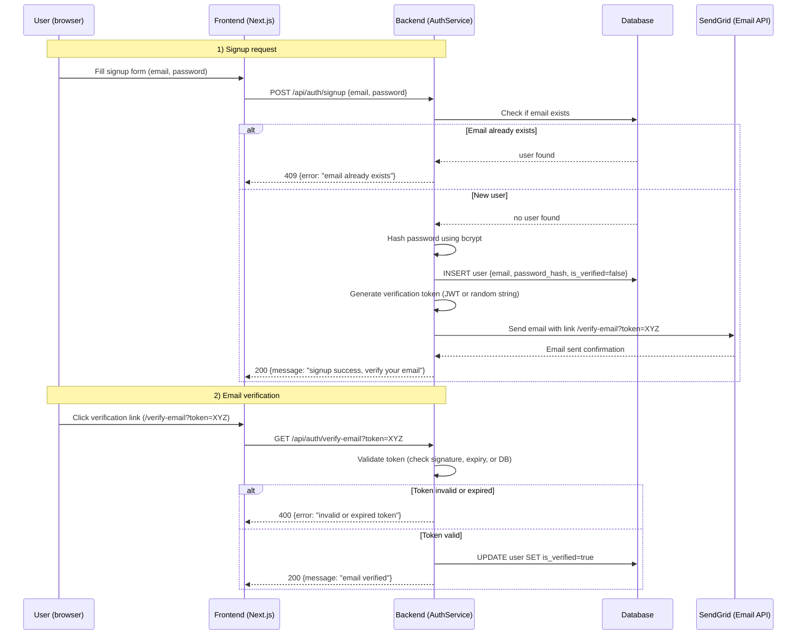
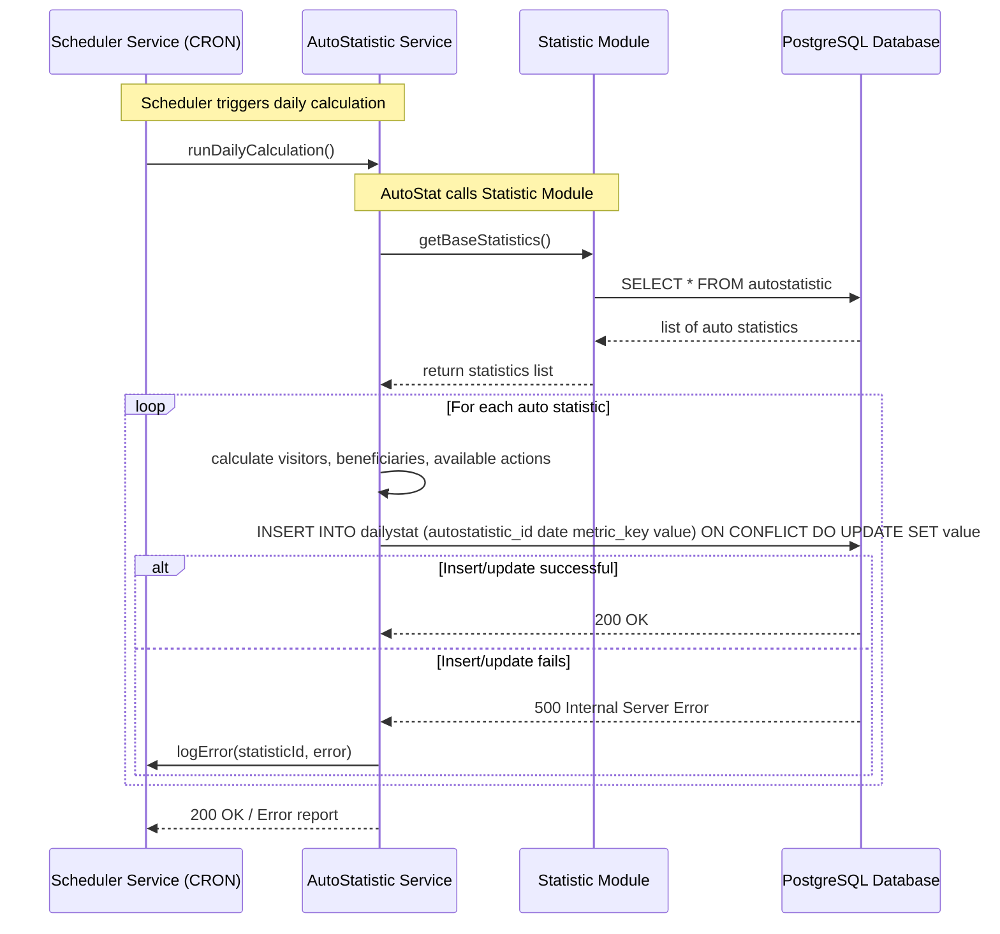

# 🌟 Zafira Solidaire – Technical Documentation

## 🗂️Summary
* [📝User Stories & Mockups](#user-stories--mockups)
* [🏗️System Architecture](#️system-architecture)
* [🧩Components, Classes & Database Design](#components-classes--database-design)
* [🔄Sequence Diagrams](#sequence-diagrams)
* [🌐API Specifications](#api-specifications)
* [🖥️Public / Frontend](#️public--frontend)
* [⚙️Admin / Dashboard](#️admin--dashboard)
* [🛠️SCM & QA Strategies](#️scm--qa-strategies)
* [💡Technical Justifications](#technical-justifications)

---
<br/>


## 📝User Stories & Mockups

Our platform is designed with multiple user types, each having distinct needs and priorities.
The following User Stories describe the main actions and goals of each type of user, structured using the MoSCoW method.

### 🧑‍💼 User Stories MosCow
#### 👀 Visitor

#### Must Have

- View the mission, objectives, and history of the association to understand its purpose.
- See the 2 latest blog articles with a link to the full blog to stay informed.
- View statistics (beneficiaries, clothes collected, etc.) to understand the association's impact.
- Browse mission, blog, workshops, and events to learn about the association's work.

#### Should Have

- See a preview of workshops with a link to the catalogue to explore professional insertion opportunities.
- Read more information about the association to learn more about the organization.
- See upcoming funded events to participate or get informed.

#### Could Have

- See partner/donor logos and contact instructions to contact or recognize contributors.

#### Won’t Have

- Access to the professional paid catalogue of the founder, which remains on a separate website.

#### 🛠️ Administrator

#### Must Have

- Add, update, or delete blog articles to keep the blog updated.
- Add or update workshops and events to keep the catalogue and events current.
- Update statistics to show up-to-date impact numbers.
- Approve beneficiary member accounts to control access to private sections.

#### Should Have

- Approve or update partner/donor logo requests to display correct supporter information.

#### Could Have

- View simple statistics (connections, accounts created, etc.) to monitor platform activity.

#### Won’t Have

- Advanced analytics; only basic stats are included.

#### 👤 Beneficiary / User

#### Must Have

- Create an account (validated by admin) to access private features such as the events calendar.
- View the event calendar to stay informed and register for events.
- Register for events via Weezevent to secure participation.

#### Should Have

- Leave a testimonial to share experiences and promote the association.

#### Won’t Have

- Native mobile application (only a responsive web application is planned).
- Full automation of workshop registrations (Weezevent integration is limited).
- Access to a “Community Club” space with messaging and activity feed.

#### 🤝 Partner / Donor / Sponsor

#### Must Have

- Be redirected to HelloAsso for secure financial contributions.
- Access contact information to arrange clothing donations directly with the association.

#### Could Have

- Have their logo displayed with contact info to show support publicly.

#### Won’t Have

- Access to the professional paid catalogue of the founder.
- Access to an online clothing donation marketplace.
- Ability to create accounts or manage logos directly via HelloAsso API integration.

### 📝 User Stories Table

The following table provides a detailed overview of the main functionalities of our platform, organized by user type.
It maps each feature to the corresponding user, describing the action they want to perform and the goal they aim to achieve.
This structured approach ensures clarity on priorities, responsibilities, and expected outcomes for the MVP.

| Class         | Feature Name                 | As a (user type)       | I want to (Action)                                         | In order to (goal)                              | URL                            | HTTP Method         |
|---------------|------------------------------|------------------------|------------------------------------------------------------|-------------------------------------------------|--------------------------------|---------------------|
| Visitor       | Homepage                     | Visitor                | View the mission, objectives and history of the association| Understand the purpose of the organization      | /                              |                     |
| Visitor       | Blog overview                | Visitor                | See the 2 latest blog articles and a link to the full blog | Stay informed about the latest news             | /blog                          | GET                 |
| Visitor       | Actions overview             | Visitor                | See a preview of actions with a link to the catalogue      | Explore opportunities for professional insertion| /actions                       | GET                 |
| Visitor       | About section                | Visitor                | Read information about the association                     | Learn more about the organization               | /hero                          |                     |
| Visitor       | Key counters                 | Visitor                | View statistics (beneficiaries, clothes collected, etc.)   | Understand the impact of the association        | /statistics/manual             | GET                 |
| Visitor       | Sponsors & donors logos      | Visitor                | See partner/donor logos and contact instructions           | Contact or recognize contributors               | /partners                      | GET                 |
| Administrator | Blog management              | Admin                  | Add, update or delete blog articles                        | Keep the blog updated                           | /admin/blog                    | GET/POST/PUT/DELETE |
| Administrator | Actions                      | Admin                  | Add or update Actions and events                           | Keep the catalogue                              | /admin/Actions                 | POST/PUT/DELETE     |
| Administrator | Key counters update          | Admin                  | Update statistics (beneficiaries, kg collected, etc.)      | Show up-to-date impact numbers                  | /statistics/manual             | PUT                 |
| Administrator | Partner logos management     | Admin                  | Approve or update partner/donor logo requests              | Display correct supporter information           | /admin/partners                | PUT/DELETE          |
| Administrator | Basic analytics              | Admin                  | View simple statistics (connect, accounts created, etc.)   | Monitor activity on the platform                | /admin/recent-events           | GET                 |
| User          | Email checking               | User                   | Check if email is valid during account creation            | Control access                                  | /auth/verify-email             | GET                 |
| User          | Account creation (local)     | Beneficiary            | Create an account (with email verification)                | Provide my data so that the admin can manage beneficiaries | /auth/signup        | POST                |
| User          | Account creation (Google Oauth2) | Beneficiary        | Create an account                                          | Access private features such as events calendar | /auth/google                   | POST                |
| User          | Testimonials                 | Beneficiary            | Leave a testimonial (Validate by admin)                    | Share experiences and promote the association   | /users/:userId/testimonials    | POST                |
| Partner       | Online donation              | Donor                  | Be redirected to HelloAsso                                 | Make secure financial contributions             | /                              |                     |
| Partner       | Clothing donations           | Donor                  | Access contact information                                 | Arrange clothing donations directly with the association | /                     |                     |
| Partner       | Logos display                | Partner/Sponsor        | Have my logo displayed with contact info                   | Show my support publicly                        | /partners                      | GET                 |
| Visitor       | Public content access        | Visitor                | Browse mission, blog, Actions, About…                      | Learn about the association’s work              | / + /subsections               | GET                 |

### 🖼️ Mockups


Our mockups were designed to give a **visual identity** to the project and to make the user stories more tangible.  
They serve as a bridge between the functional vision and the actual interface, helping both the development team and stakeholders to project themselves into the future platform.  

The design was conceived following a **Mobile First approach**, as nowadays most users access content primarily through their smartphones, while desktop usage is becoming secondary.  
This ensures that the mobile experience is fluid, accessible, and intuitive, while still providing a web version for desktop users when needed.  

To ensure accessibility, the mockups are available in multiple formats:  

- A **GIF** to quickly preview the main flows,  
- **Figma** for full exploration,  
- And **PDF exports** to preserve a static, sharable version.  

A special effort was made on the **visual identity**. The chosen color palette combines **vivid tones** with **sobriety and elegance**, in order to remain both professional and engaging.  
This balance not only enhances readability but also ensures coherence with the values of the association. Even in the absence of direct feedback, the design has been shaped to reflect the expectations expressed by its president and to stay faithful to the organization’s image.  

In short, these mockups are more than just visuals: they are a **design foundation** aligned with user needs, technical feasibility, and the association’s identity.  

---

#### 📂 Deliverables

#### 🎨 Figma Designs

- [🌐 Web Mockup (Figma)](https://www.figma.com/community/file/1552746420096755192)  
- [📱 Mobile Mockup (Figma)](https://www.figma.com/community/file/1552745867417046514)  

#### 📄 PDF Versions

- [🌐 Web Mockup PDF](https://github.com/JeffToken31/Portfolio-project-Zafira/blob/main/stage3/annexes/Zafira_website-mockup.pdf)  
- [📱 Mobile Mockup PDF](https://github.com/JeffToken31/Portfolio-project-Zafira/blob/main/stage3/annexes/Zafira_mobil-mockup.pdf)  

## 🏗️System Architecture

The architecture of our MVP has been designed with **modularity** and **scalability** in mind.  
It separates the responsibilities into clear layers, making the system easier to maintain, extend, and secure.

### 🔹 High-Level Architecture

This diagram shows the main components of the system and their interactions:



### 🖥️ Frontend (Next.js)

- Provides all the public pages (*mission, blog, workshops, events*).
- Two dashboards:
  - **Beneficiary Dashboard**: personalized features (calendar, testimonials).
  - **Administrator Dashboard**: content and user management.

### ⚙️ Backend (NestJS)

- Organized into independent modules:
  - User, Blog, Action, Testimonial, Partner, Statistic.
- Includes transversal services:
  - Authentication
  - Notifications
  - Scheduling tasks

### 🗄️ Database (PostgreSQL)

- Central storage for all persistent entities:
  - Users, blog articles, workshops, statistics, testimonials, partners.
- Relational structure ensures **data integrity** and facilitates **reporting**.

### 🌍 External Services

- **Weezevent**: event registration and ticketing.
- **HelloAsso**: secure donations and sponsorships.
- **Google Auth**: authentication via Google accounts.
- **Sendgrid**: transactional emails (notifications, confirmations).

---

### 🔹 Data Flow

- Users (web or mobile) interact with the **frontend**.
- For **public content** (mission, blog, events), the frontend may:
  - Call the backend, or
  - Directly embed external services (e.g., Weezevent iframe).
- **Authenticated users** (beneficiaries, admins) access dashboards, which call the **backend API**.
- The backend:
  - Communicates with the **database** for CRUD operations.
  - Synchronizes with **external services** when required (HelloAsso, Sendgrid, etc.).
- Notification services ensure **real-time** or **scheduled updates**  
  (e.g., when a testimonial is submitted or a new action is created).

### 📚 System Layer Overview

The following diagram illustrates the different layers of the system (presentation, business logic, persistence, and external services), showing how responsibilities are separated to ensure maintainability and scalability.



## 🧩Components, Classes & Database Design

This section details the internal structure of the MVP. It covers three main aspects:  

1. **Backend domain classes** (entities, relationships, and methods).  
2. **Database schema** (tables, attributes, and relations).  
3. **Frontend components** (UI structure and sections).  

The goal is to show how the system is organized at different levels, ensuring consistency between code, storage, and user interface.

---

### 🔹 Domain Classes (Backend)

The following diagram describes the core classes of the backend domain model.  
It includes users, credentials, content modules (blogs, actions, testimonials), partners, and statistics.  
We also added enumerations such as roles, media types, and testimonial status to make entities more robust.



### 🔹 Database Schema

To persist these entities, we designed a relational schema in PostgreSQL.
The diagram below shows the tables, their attributes, and how they connect.
It ensures data integrity (via foreign keys) and supports reporting features (statistics, manual entries, daily snapshots).



### 🔹 Frontend Components

The frontend is structured into reusable components that follow a **Mobile-First** approach.  
The design emphasizes clarity, accessibility, and alignment with the association’s visual identity.

📷 **Component Diagram**  


---

### 🏠 Main Structure

#### 🏡 Header

Navigation bar with "Zafira Solidaire" logo, main menu (Actions, Mission, Testimonials, News, FAQ) and action buttons (Admin, Login, Donate).

#### ⭐ Hero

Homepage section with tagline *"Restoring confidence through image"*, presentation of the professional integration association, and call-to-action *"Discover our actions"*.

#### 📊 Stats

Impact metrics: number of Beneficiaries, Clothing weight, number of Workshops.  
Detailed section with key figures.

#### 📰 Blog/News

*"Our latest news"* with recent articles: New self-image workshop, Large clothing collection, Job Center Partnership *(Sept 2025 dates)*.

---

### 👥 Project Presentation

#### 👤 About Zafira

*"Our mission"* section presenting values (Kindness, Efficiency, Solidarity), history and description of personalized support.

#### 💬 Testimonials

*"They share their experience"* with testimonials.  
Satisfaction indicators (% positive reviews, number of testimonials).

---

### 🎯 Actions and Engagement

#### 🎯 Our Actions

*"Concrete actions"*: Self-image workshops, Individual support, Institutional partnerships with details on each service offered.

#### ✋ Become Beneficiary Signup

*"Join our mission"* with call-to-action *"Become a beneficiary"* and *"See all our actions"*.

#### ❓ FAQ

*"Frequently Asked Questions"* section organized by categories (Services, Donations, Partnerships) with common questions about services, collections and partnerships.

#### 👕 Clothing Donations

*"Participate in our mission"* section detailing clothing donations (accepted types, collection points, schedules).

#### 💰 Financial Donations

Financial support section with HelloAsso donation link and tax benefits information *(66% tax reduction)*.

---

### 🤝 Partnerships and Tools

#### 🤝 Partners

*"Together, we go further"* presenting the active partners, including Job Center, Local Mission, CCAS with call-to-action *"Become a partner"*.

#### 📋 Dashboard

Administrator interface with analytics (visitors per day, total visitors, registered beneficiaries) and personal user space (profile, activities, testimonials).

#### 🔻 Footer

Complete legal information: contact details (18 rue Charles Gouppy, Aulnay-sous-Bois), institutional links, social networks, newsletter and legal notices.

## 🔄Sequence Diagrams

To illustrate the main runtime flows of the application, three sequence diagrams have been prepared.  
They show the interactions between frontend, backend, database and external services for critical use cases: authentication, signup, and statistics generation.

### 🔐 Google OAuth Authentication Flow

This diagram explains the full Google OAuth sign-in flow:

- backend provides the Google auth URL (with a CSRF state),
- user is redirected to Google and consents,
- frontend sends the returned code to the backend,
- backend exchanges the code for tokens, verifies the ID token, and creates or retrieves the user in the database,
- backend issues the application JWT and refresh token.



#### ✉️ Local Signup with Email Verification (SendGrid)

This diagram describes the signup process using email/password and SendGrid for verification:

- user submits the signup form,

- backend hashes the password and creates a user record with is_verified=false,

- backend generates a verification token and sends the email via SendGrid,

- user clicks the verification link, backend validates the token, and marks the account as verified.



#### 📈 Statistics Generation

This diagram illustrates the scheduled statistics pipeline:

- a scheduler triggers the AutoStatistic service daily,

- AutoStatistic retrieves base statistics and computes metrics (visitors, beneficiaries, available actions),

- results are inserted/updated in the database as daily snapshots, with error handling and reporting.



## 🌐API Specifications

This section documents all internal and external APIs integrated into the application.  
It includes authentication flows, content management, statistics, user management, and partner/event services.  
Each subsection provides context, purpose, and expected usage to guide developers and maintainers.

---

### 🔑 Authentication APIs

These endpoints manage user authentication, including local signup/login, Google OAuth login, and email verification.  
They also allow users to manage their own profiles and passwords, while admin endpoints handle full user management.

| URL                     | Method | Role      | Input                                         | Output                        | Notes                                          |
|-------------------------|--------|-----------|-----------------------------------------------|-------------------------------|------------------------------------------------|
| /api/auth/signup        | POST   | Visitor   | {email, password, first_name, last_name}     | {message}                     | Create a new user + send verification email   |
| /api/auth/login         | POST   | Visitor   | {email, password}                             | {access_token, user}          | Returns JWT if login successful               |
| /api/auth/google/url    | GET    | Visitor   | -                                             | {url}                          | Generates Google OAuth URL with state         |
| /api/auth/google        | POST   | Visitor   | {code, state}                                | {access_token, user}          | Exchange Google code for app token            |
| /api/auth/verify-email  | GET    | Visitor   | ?token=XYZ                                   | {message}                     | Verify email via token                         |
| /api/auth/me            | GET    | User      | -                                             | {user}                        | Retrieve own profile                           |
| /api/auth/me            | PUT    | User      | {first_name?, last_name?, email?}            | {user}                        | Update own profile                             |
| /api/auth/me/password   | PUT    | User      | {current_password, new_password}             | {message}                     | Change own password                            |
| /api/users/:id          | PUT    | Admin     | {first_name?, last_name?, email?, role?}     | {user}                        | Update any user profile                        |
| /api/users/:id          | DELETE | Admin     | -                                             | {message}                     | Delete a user                                  |

---

### 📰 Blog APIs

Blog APIs allow both public access to published content and admin management for creating, updating, or deleting posts.  
Public endpoints are used for the frontend display, while admin endpoints provide full dashboard capabilities.

## 🖥️Public / Frontend

| URL | Method | Role | Input | Output | Notes |
|-----|--------|------|-------|--------|-------|
| /api/blogs | GET | Public | - | JSON array [{id, author_id, title, slug, excerpt, cover_image_url, media_url, media_type, published, published_at}, ...] | Retrieves all published blogs |
| /api/blogs/:id | GET | Public | id in URL | JSON {id, author_id, title, slug, excerpt, content, cover_image_url, media_url, media_type, published, published_at} | Retrieves a specific published blog |

## ⚙️Admin / Dashboard

| URL | Method | Role | Input | Output | Notes |
|-----|--------|------|-------|--------|-------|
| /api/admin/blogs | GET | Admin | - | JSON array of all blogs [{id, author_id, title, published, ...}, ...] | Lists all blogs, published or not |
| /api/admin/blogs | POST | Admin | {title, slug, content, excerpt, cover_image_url, media_url, media_type, published} | JSON {id, title, ...} | Creates a new blog |
| /api/admin/blogs/:id | PUT | Admin | {title?, slug?, content?, excerpt?, cover_image_url?, media_url?, media_type?, published?} | JSON {id, title, ...} | Updates an existing blog |
| /api/admin/blogs/:id | DELETE | Admin | id in URL | JSON {success: true} | Deletes a blog |

### 🤝 Partner APIs

These endpoints manage partners of the association, including public read-only access for the website carousel, and admin endpoints for CRUD operations.  
Partners information includes logo, contact details, and website links.

| URL | Method | Role | Description | Input | Output | Notes |
|-----|--------|------|-------------|-------|--------|-------|
| /api/partners | GET | Public / Front | Get all partners for carousel | - | [ { id, company_name, logo_url, website_url, contact_name, contact_email, contact_phone }, ... ] | Only published partners, read-only |
| /api/admin/partners | GET | Admin | Get all partners (published and unpublished) | - | [ { id, company_name, logo_url, website_url, contact_name, contact_email, contact_phone }, ... ] | Full list for dashboard |
| /api/admin/partners | POST | Admin | Create a new partner | { company_name, logo_url, website_url, contact_name, contact_email, contact_phone } | { id, company_name, ... } | Admin only |
| /api/admin/partners/:id | PUT | Admin | Update an existing partner | { company_name?, logo_url?, website_url?, contact_name?, contact_email?, contact_phone? } | { id, company_name, ... } | Admin only |
| /api/admin/partners/:id | DELETE | Admin | Delete a partner | - | { success: true } | Admin only |

### 🎉 Recent Event APIs

Recent Event APIs log and retrieve key activities and events.  
Admins can view or create entries; internal/scheduler calls allow automated logging.

| URL | Method | Role | Description | Input | Output | Notes |
|-----|--------|------|-------------|-------|--------|-------|
| /api/admin/recent-events | GET | Admin | Get all recent events | - | [ { id, event_type, description, created_at }, ... ] | For admin dashboard overview |
| /api/admin/recent-events | POST | Internal / Admin / Scheduler | Create a new recent event | { event_type, description } | { id, event_type, description, created_at } | Internal usage or admin logs important events |

### 📊 Statistics APIs

Statistics APIs are split into manual and auto-calculated metrics.  
Public endpoints provide read-only access for dashboards and front-end display, while admin endpoints allow full management, and internal endpoints handle automated calculations.

#### Front / Public

| URL | Method | Role | Description | Input | Output | Notes |
|-----|--------|------|-------------|-------|--------|-------|
| /api/statistics/manual | GET | Public / Front | Get all manual statistics with entries | - | [ { id, name, base_stat_id, entries: [ { id, date, quantity, note, created_by }, ... ] }, ... ] | Read-only for front |
| /api/statistics/auto | GET | Public / Front | Get all auto statistics with daily snapshots | - | [ { id, statistic_id, visitors_per_day, total_beneficiaries, available_actions, daily_stats: [ { id, date, value }, ... ] }, ... ] | Read-only for front |

#### Admin/Dashboard

| URL | Method | Role | Description | Input | Output | Notes |
|-----|--------|------|-------------|-------|--------|-------|
| /api/admin/statistics/manual | GET | Admin | List all manual statistics | - | [ { id, name, base_stat_id, ... }, ... ] | Admin can see all |
| /api/admin/statistics/manual/:id | GET | Admin | Get detail of a manual statistic | id | { id, name, base_stat_id, entries } | Admin only |
| /api/admin/statistics/manual | POST | Admin | Create a new manual statistic | { name, base_stat_id } | { id, name, ... } | Admin only |
| /api/admin/statistics/manual/:id | PUT | Admin | Update a manual statistic | { name?, base_stat_id? } | { id, name, ... } | Admin only |
| /api/admin/statistics/manual/:id | DELETE | Admin | Delete a manual statistic | - | { success: true } | Admin only |
| /api/admin/statistics/manual/:id/entry | POST | Admin | Create a manual entry | { date, quantity, note, created_by } | { id, date, quantity, note, created_by } | Admin only |
| /api/admin/statistics/manual/:id/entry/:entryId | PUT | Admin | Update a manual entry | { date?, quantity?, note? } | { id, date, quantity, note } | Admin only |
| /api/admin/statistics/manual/:id/entry/:entryId | DELETE | Admin | Delete a manual entry | - | { success: true } | Admin only |
| /api/admin/statistics/auto | GET | Admin | List all auto statistics | - | [ { id, statistic_id, visitors_per_day, total_beneficiaries, available_actions }, ... ] | Admin only |
| /api/admin/statistics/auto/:id/calculate | POST | Admin / Internal | Recalculate auto statistics | - | { success: true, recalculated_count: X } | Can also be called by internal scheduler |

#### Internal/Scheduler

| URL | Method | Role | Description | Input | Output | Notes |
|-----|--------|------|-------------|-------|--------|-------|
| /api/internal/statistics/auto/calculate | POST | Internal / Scheduler | Trigger recalculation of auto statistics | - | { success: true, recalculated_count: X } | Called by cron scheduler internally|

#### 💬 Testimonial APIs

Testimonials allow beneficiaries to share their experiences, while admins can review, approve, or delete them.  
Endpoints cover both user-level creation and retrieval, and admin-level management.

| URL | Method | Role | Description | Input | Output | Notes |
|-----|--------|------|-------------|-------|--------|-------|
| /api/users/:userId/testimonials | POST | User | Create a new testimonial | { title, content } | { id, userId, title, content, status, created_at } | User (beneficiary) creates a testimonial |
| /api/users/:userId/testimonials | GET | User | Get all testimonials by the user | - | [ { id, userId, title, content, status, created_at }, ... ] | For user dashboard |
| /api/users/:userId/testimonials/:testimonialId | GET | User | Get a specific testimonial by ID | testimonialId in URL | { id, userId, title, content, status, created_at } | For user dashboard |
| /api/admin/testimonials | GET | Admin | Get all testimonials | - | [ { id, userId, title, content, status, created_at }, ... ] | Admin dashboard view |
| /api/admin/testimonials/:id | PUT | Admin | Update a testimonial | { title?, content?, status? } | { id, userId, title, content, status, updated_at } | Admin can approve, reject, or modify testimonials |
| /api/admin/testimonials/:id | DELETE | Admin | Delete a testimonial | id in URL | { success: true } | Admin removes a testimonial |

### 🌐 External APIs

External APIs include third-party services integrated into the system for authentication, email, events, and donations.  
Each service is embedded securely or accessed via backend routes depending on its purpose.

| API | Purpose | Integration | Notes |
|-----|---------|------------|-------|
| **Google OAuth** | Allow users to log in with their Google account | Backend routes `/api/auth/google/url` (GET) & `/api/auth/google` (POST) | OAuth flow: backend generates login URL, exchanges authorization code for access token, and returns JWT to frontend. Used for quick signup/login without password. |
| **WeezEvent** | Display events or donation information | Frontend iframe | Embedded directly on the homepage. Provides information about ongoing campaigns or events. No backend route needed. |
| **HelloAsso** | Handle donations | Frontend iframe | Embedded on donation pages. Users can donate without leaving the site. No backend route needed. |
| **SendGrid** | Send verification emails and notifications | Backend service | Triggered internally when a user signs up or needs to verify their email. Ensures reliable email delivery. No API route is exposed publicly; all email operations happen server-side. |

#### Google OAuth

**Purpose:** Allow users to log in with their Google account.  
**Integration:** Backend routes `/api/auth/google/url` (GET) & `/api/auth/google` (POST).  
**Notes:** OAuth flow is handled securely on the backend. Exchanges authorization code for JWT.
**Flow:**

1. Visitor clicks "Login with Google" button.
2. Backend generates Google OAuth URL and redirects user.
3. User authorizes app; Google returns an authorization code.
4. Backend exchanges code for access_token and returns app JWT.

#### Weezevent

**Purpose:** Display upcoming events and allow users to buy tickets directly.  
**Integration:** Embedded via iframe on the front-end, no backend route required.  
**Notes:** Payments and ticketing are managed fully by Weezevent, so no sensitive data is stored in our system.

**Flow:**

1. User visits "Events" page.
2. Frontend loads Weezevent iframe with organization’s ID.
3. User browses events and selects tickets inside the iframe.
4. Payment and confirmation are handled directly by Weezevent.

#### HelloAsso

**Purpose:** Enable users to make donations online.  
**Integration:** Embedded via iframe on the front-end, no backend route required.  
**Notes:** Donation flows, payment handling, and receipts are fully managed by HelloAsso. No sensitive payment data is stored in our system.

**Flow:**

1. User navigates to "Donations" page.
2. Frontend loads HelloAsso iframe with campaign or organization’s ID.
3. User selects donation amount and fills in required details directly in iframe.
4. Payment and confirmation are processed by HelloAsso.
5. User receives confirmation email from HelloAsso (outside our system).

#### SendGrid

**Purpose:** Manage professional and reliable email delivery (transactional and notification emails).  
**Integration:** Backend service calls SendGrid API via official SDK (`@sendgrid/mail`).  
**Notes:** Used for email verification during signup, password reset, and transactional messages (e.g., account confirmation, testimonial approval).

**Flow:**

1. User performs an action that requires an email (e.g., account signup).
2. Backend generates a verification token or transactional payload (e.g., JWT or stored token).
3. Backend calls SendGrid SDK to send an email with recipient, subject, template ID and dynamic data (including verification link with token).
4. SendGrid receives the request and delivers the email to the user.
5. User clicks verification link or follows instructions in the email.
6. Backend validates the token (checks existence, expiry, and association with user) and completes the process.

## 🛠️SCM & QA Strategies

###  GitHub Workflow – Source Code Management

We use GitHub to manage our source code. Here is our workflow and rules:

#### 1️⃣ Branches

- Main: Stable, production-ready code.
- Dev: Development branch, where all new features and fixes are integrated before going to Main.
- Issue branches: One branch per issue (fix, add, feat, etc.).

#### 2️⃣ Development Workflow

1. Create an Issue before commit
Title should start with a keyword describing the change:
    Fix → bug fix
    Add → add a feature
    Feat → new functionality
Example: Fix login page

2. Create a local branch  

```bash
git checkout -b <title>/#<issue-number>
or
git checkout -b <issue-number>-<title>

Example: 
git checkout -b fix-login/#12
git checkout -b issue-11-Task5-of-the-stage3
```

3. Develop and commit  

```bash
git commit -m '(close #<issue_number>) : description of the commit'
or
git commit -m 'description of the commit (close #<issue_number>)'
Example: 
git commit -m '(close #12) : corrected login form'
git commit -m 'Add Task5 of the stage3 (close#11)'
```

```bash
Coding example in our Portfolio:
# Control and change the branch
git status
git switch dev
# Create and switch to a new branch (with no spaces)
git checkout -b Task5-of-the-stage3
# Add and commit changes
git add .
git commit -m "Add Task5 of the stage3 (#11)"
# Push branch to origin
git push origin Task5-of-the-stage3
```

4. Push & Pull Request  

```bash
git push origin <title>/#<issue_number>
```

- Open a Pull Request from your branch to Dev.
- After review and approval → merge into Dev.

5. Merge Dev into Main  

- Once Dev is stable and tested, merge into Main for production.

#### 3️⃣ Workflow Diagram (Concise View)

```bash
Main (stable) <----- Dev (development) <----- Feature/Issue branches
```

#### ✅ Benefits

Clear traceability of changes via Issues.  
Organized development with isolated feature branches.  
Gradual and controlled integration into Main.  

###  Quality Assurance (QA) Strategy

#### Layer-by-Layer Strategy

##### Frontend (Next.js)

- Unit Tests: React components, hooks, utilities
- Integration Tests: Complete pages, Context Providers
- E2E Tests: Critical user journeys

##### Backend (NestJS)

- Unit Tests: Services, controllers, repositories
- Integration Tests: API endpoints, database
- Contract Tests: External APIs (Google OAuth, WeezEvent)

##### Database

- Data Tests: Migrations, constraints, performance
- Backup Tests: Backup and restore procedures

#### Testing tools

#### 1️⃣ Unit Tests

It tests individual functions or components.

- Jest:
  - Test a single behavior per test
  - Keep tests fast and run on every commit  
Example:
  - Validating email or form inputs

#### 2️⃣ Integration Tests

It verifies multiple modules work together correctly.

- Supertest, SQL:
  - Cover critical flows
  - Automate tests in CI pipelines  
Example:
  - Form submission to backend returns correct response
  - Blog controller

#### 3️⃣ API Tests

It ensures API endpoints function as expected and follows documentation.

- Postman, Swagger:
  - Automate Postman collection runs in CI/CD
  - Keep Swagger docs updated  
Example:
  - Test GET/POST/PUT/DELETE endpoints

#### 4️⃣ End-to-End (E2E) Tests

We test the complete user journey.

- Cypress or Playwright (optional):
  - Focus on critical user flows
  - Maintain stable and maintainable tests  
Example:
  - Beneficiary journey

#### 5️⃣ Manual Testing

That verifies critical functionality and UX  

- Browser, mobile emulator, QA checklists
  - Document test results and bugs
  - Prioritize high-impact features  
Example:
  - Responsive design verification

#### Zafira - Possible Specific Testing Strategy

|Title|Tests|
|-----|-----|
|Beneficiary Journey|Google OAuth login|
||Beneficiary dashboard navigation|
||Action request submission|
||Testimonial submission|
||Resquest status tracking|
|Admin Journey|Admin authentication|
||Blog article management|
||Action request validation|
||Partner management|
||Statistics consultation|
|External Integrations|Google OAuth API|
||WeezEvent API|
||HelloAsso API|

## 💡Technical Justifications

Considering the high growth potential of the association, we carefully selected technologies that allow for a scalable and maintainable architecture, adaptable over the project’s entire lifecycle. This approach also provides valuable learning experience, helping us adopt best practices expected by recruiters in modern web development.

### 🌐 Frontend

#### Next.js

- Chosen for performance, server-side rendering (SSR/SSG), and SEO friendliness.

- Enables modular development with reusable pages and components.

- Scalable structure: easy to add new features without adding unnecessary complexity.

**React**:

- Core of Next.js: reusable components, declarative UI, dynamic state management.

- Large ecosystem and community support for long-term maintenance and evolution.

**Tailwind CSS**:

- Rapid prototyping with utility-first classes.

- Ensures a responsive, mobile-first interface.

- Maintains consistent and easily modifiable design.

**Global CSS**:

- For universal rules, variables, and overrides.

- Complements Tailwind for custom styles.

**Iframes (Weezevent, HelloAsso)**:

- Embed external services for events and donations without handling payments internally.

- Ensures security and simplicity.

#### ⚙️ Backend

**NestJS**:

- Node.js framework based on Express and TypeScript.

- Promotes a scalable and maintainable architecture with independent modules.

- Easy to extend functionality without rewriting core architecture.

- Simplifies route, middleware, and service management for a professional-grade project.

**Express.js**:

- Lightweight and performant REST API engine used internally by NestJS.

**Prisma ORM**:

- Secure, typed communication with PostgreSQL.

- Automatic query and migration management.

- Improves security, maintainability, and developer productivity.

**Authentication & Security**:

- JWT + Refresh Tokens for secure sessions.

- bcrypt for password hashing.

- Google OAuth for quick login.

- SendGrid for verification emails.

#### 🗄 Database

**PostgreSQL**:

- Robust, relational, and scalable database.

- Supports complex transactions and entity relationships (users, blogs, stats…).

- Ensures reliability and scalability for the association’s growth.
